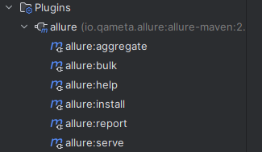
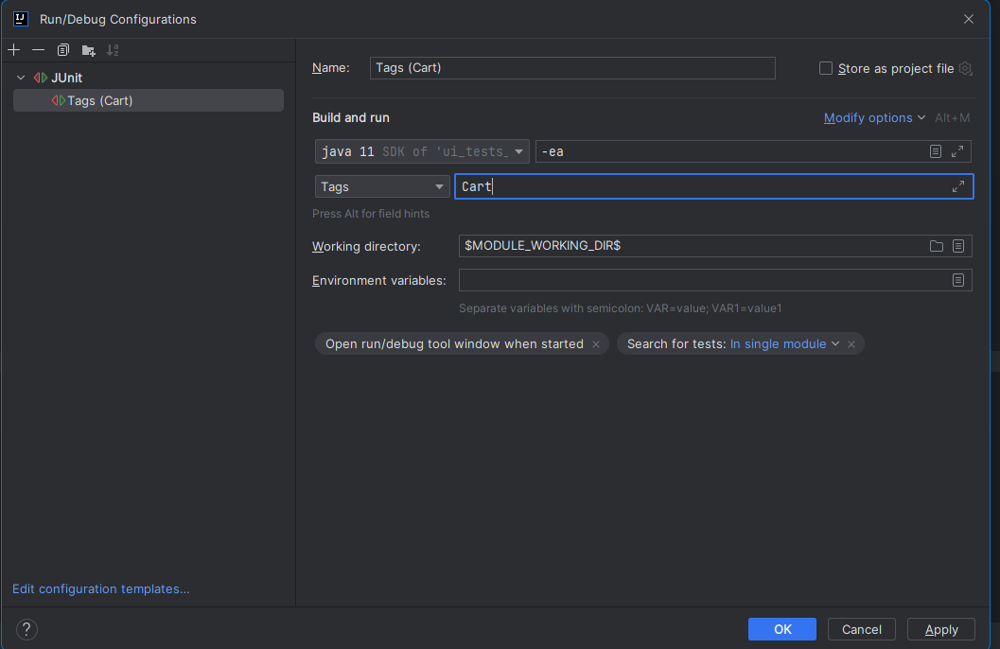
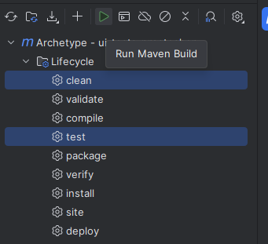

# How to run tests?

You can use [bootstrap] to select `browser` which you want. The `chrome` is default.
All browsers could be specified in [application] file as profiles with additional properties.

Use IDEA, f.e. IntelliJ Idea:
1. Open [AddProductsToCartTest] test class
2. Select any test and click on icon against to test method (to run just one test) or test class (to run all tests in class):
   

3. You can generate allure report after test execution via `allure serve` or `allure report` command in terminal or via maven plugin

Or you can create build configuration with Tags, f.e.:

See possible tags in the [AddProductsToCartTest] test class

Also, you can run tests via maven plugin in IDEA:
1. Open Lifecycle
2. Select `clean` and `test` together

NOTE: Allure report will be automatically generated and opened after end of test execution.
Do not forget to stop allure server. 

[application]: /src/test/resources/application.yml
[bootstrap]: /src/test/resources/bootstrap.yml
[AddProductsToCartTest]: /src/test/java/broit/homework/AddProductsToCartTest.java