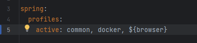
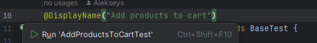

# How to run tests?

You can use [bootstrap] to select `browser` which you want and have on your PC. The `chrome` is default.
All browsers could be specified in [application] file as profiles with additional properties.

### Docker

If you have docker and selenoid - you can run tests in Docker - just add `docker` profile in spring.active.profiles in the [bootstrap] file.
F.e.:

## IDEA 
To run idea use IDEA, f.e. IntelliJ Idea:
1. Open [AddProductsToCartTest] test class
2. Select any test and click on icon against to test method (to run just one test) or test class (to run all tests in class):
   

Another way, you can create build configuration with Tags, f.e.:

See possible tags in the [AddProductsToCartTest] test class

Also, you can run tests via maven plugin in IDEA:
1. Open Lifecycle
2. Select `clean` and `test` together

# REPORT:
You can generate allure report after test execution via `allure serve` or `allure report` command in terminal or via maven plugin

[application]: /src/test/resources/application.yml
[bootstrap]: /src/test/resources/bootstrap.yml
[AddProductsToCartTest]: /src/test/java/broit/homework/AddProductsToCartTest.java